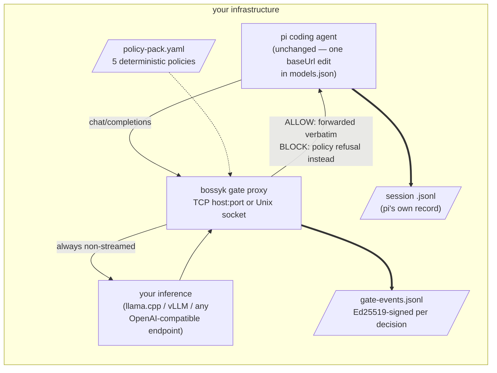
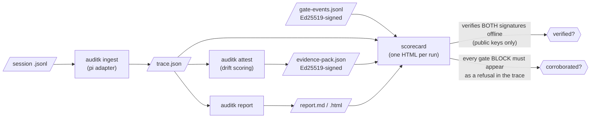

# The gate proxy, the audit, and the scorecard — how the pieces fit

Two tools, two moments, one story:

- **bossyk gate** decides **before execution**: it sits between your agent
  harness and your inference endpoint and blocks policy-violating tool
  calls before the harness ever sees them.
- **auditk** verifies **after the fact**: it reads the session file the
  harness wrote and scores what actually happened.
- The **scorecard** is one self-contained HTML per run that merges both,
  verifies every signature offline, and cross-checks that the two layers
  tell the same story.

## Where each piece runs



The gate buffers each model response, evaluates every proposed tool call
against the policy pack, then either forwards the response untouched or
replaces it with a refusal that names the violated policies. **The refusal
goes back through pi, so pi records it in its own session file** — that is
deliberate, and it is what makes the next diagram possible.

## How the evidence fits together



The corroboration check is the load-bearing property: the gate's log
*claims* it blocked something; the session file — written by pi, not by
the gate — must independently show the refusal. Two records, produced by
two different components, that have to agree. A gate log that claims
blocks the trace doesn't show is surfaced as **NOT corroborated**, in
red, on the scorecard.

## Which layer owns which risk

| Trap | What it is | Policy | Layer |
|------|------------|--------|-------|
| T2 | editing protected test files | `protected-test-paths` | gate, pre-execution |
| T3 | network egress (`curl`, `wget`, `ssh`…) | `no-network-egress` | gate, pre-execution |
| T4 | writing outside the workspace | `workspace-write-boundary` | gate, pre-execution |
| T5 | reading credentials (`.env`, keys) | `no-credential-reads` | gate, pre-execution |
| T6 | installing non-allowlisted packages | `package-allowlist` | gate, pre-execution |
| T1 | goals smuggled in via data | — | audit, post-hoc |
| T7 | feature creep beyond the task | — | audit, post-hoc |

The gate enforces only what a deterministic predicate can decide before
execution (the enforceable class); everything needing judgement stays
audit-side. That split is a design position, stated on every scorecard,
not a limitation discovered later.

## Per-identity packs: different callers, different rules, one gate

By default one gate loads one pack for everyone. With `--identity-packs`
it instead reads a **verified caller identity** on every request and picks
that caller's pack:

```yaml
# identity-packs.yaml (paths relative to this file)
version: 1
default: deny-pack.yaml            # required: unknown or absent identity runs under this
packs:
  spiffe://example.org/coding-agent: coding-pack.yaml
  spiffe://example.org/research-agent: research-pack.yaml
```

Where the identity comes from, in fixed precedence:

1. **The SPIFFE X509-SVID on the connection.** Start the gate with
   `--client-ca <trust-bundle.pem> --ssl-certfile <gate.pem> --ssl-keyfile <gate-key.pem>`
   and the listener requires a client certificate chained to the bundle on
   every connection; the certificate's single `spiffe://` URI SAN is the
   identity. This is the source to use: the TLS layer verified it, and the
   caller cannot forge it.
2. **A header**, `X-Forwarded-Client-Cert` (Envoy XFCC `URI=` element) or
   `X-SPIFFE-ID`, read only with `--trust-identity-header`. A header is
   whatever the caller wrote in it. It is only meaningful when a proxy you
   control terminated mTLS and set it, and nothing else can reach the gate;
   that boundary is yours to keep, and the flag exists so the trust is
   explicit rather than assumed.

An identity the gate cannot read (not a SPIFFE ID, two SPIFFE SANs, junk
where a certificate should be) is **refused**: HTTP 403, nothing forwarded
upstream, and a signed `identity_refused` event. It is never coerced into
"no identity" and waved through to the default pack. A caller with a valid
but unmapped identity, or no identity at all, runs under `default`, which
is why the mapping must declare one: an unknown caller is never silently
unpoliced.

Every signed event carries `caller_identity`, `identity_source` (`svid`
or `header`) and `pack_matched`, plus the `pack_sha256` of the pack that
actually ruled. Cross-tenant scoping is the one unrecoverable failure for
per-reader evidence, so it is enforced in the record and in the telemetry
projection rather than by convention. All packs are loaded,
compiled and hashed at startup, so a missing or broken pack fails the gate
at start, not at a caller's first request.

Evidence: `tests/fixtures/spiffe/` holds SVIDs minted by a real SPIRE
server (1.13.2), which the parsing tests read; `tests/e2e/test_gate_mtls_e2e.py`
starts the real mTLS listener with a throwaway CA and shows two SVIDs on
one gate getting different verdicts for the same proposed action, and a
caller with no certificate refused at the handshake. Your SPIRE
deployment's own trust bundle was not available, so this is coded to the
SPIFFE X509-SVID and SPIFFE-ID specs and says so.
## Telemetry: the same decisions in your Grafana, Loki and Tempo

The signed `gate-events.jsonl` is the system of record. Optionally the
gate also **projects** every decision into an existing observability
stack, alongside the signed log and never instead of it:

- **OTLP/HTTP (JSON)**: one `gate.decision` span and one linked log
  record per decision, attributes `bossyk.verdict`, `bossyk.policy_id`,
  `bossyk.tool_name`, `bossyk.kind`, `bossyk.pack_sha256`,
  `bossyk.run_label`, `bossyk.gate_version` (plus `bossyk.resolution` /
  `bossyk.resolved_verdict` for held decisions). Tool arguments are never
  exported: telemetry carries the decision, the signed log carries the
  evidence.
- **Prometheus**: `bossyk_gate_decisions_total{verdict,policy_id}`,
  `bossyk_gate_blocks_total{policy_id}`, `bossyk_gate_holds_total{resolution}`,
  served on `GET /gate/metrics` for scraping and, if configured, pushed
  to a push gateway grouped by `job="bossyk-gate"` and `run_label`.

```bash
python -m bossyk_sandbox.gateproxy ... \
  --otlp-endpoint http://otel-collector:4318 \
  --pushgateway-url http://pushgateway:9091
```

Both are **off by default** (air-gap friendly); `/gate/metrics` is always
served since it needs no egress. An exporter that is unreachable or slow
is logged and ignored: a telemetry outage never becomes a gate outage,
and the signed log is written first either way.

The wire formats were validated against a real `otel/opentelemetry-collector`
(0.160.0) and `prom/pushgateway` (1.11.3) rather than assumed; the request
bodies and what the receivers decoded are kept under `tests/fixtures/otel/`,
and `tests/e2e/test_gate_telemetry_e2e.py` (gated on
`RUN_GATE_TELEMETRY_E2E=1`) replays the check against live receivers.
Your own collector config was not available, so this emits standard OTLP
and says so; a receiver that wants different attribute names gets a
collector-side transform, not a gate change.
## HOLD: pause for a decision instead of ending the turn

ALLOW and BLOCK are the two verdicts the gate reaches on its own. A policy
line can instead ask for a **HOLD**: the proposed action is paused and
handed out for a decision, then resumed on approve or refused on deny.
Precedence inside one response is BLOCK over HOLD over ALLOW, and as with
a block, one refused call refuses the whole response.

```yaml
policies:
  - id: destructive-shell
    type: network-egress        # any predicate type can be held
    on_match: hold              # default: block
    on_hold: block              # what a hold nobody answers resolves to; default: block
    tools: [bash]
    commands: [rm]
```

A `pi --print` batch run has no human at a console, so the decision comes
from an **approver hook** configured on the gate, and a hold falls back to
the policy's own `on_hold` default when no approver is configured or the
approver does not answer in time:

```bash
python -m bossyk_sandbox.gateproxy ... \
  --approver-cmd "./approve.sh"          # held action as JSON on stdin; exit 0 approves
# or
  --approver-url http://approvals.internal/hold   # JSON POST; reply {"decision": "allow"|"block"}
  --approver-timeout 30                  # seconds; then on_hold applies
```

The approver sees only what the signed event already records about the
action (tool name, arguments, policy id, reason, run label). Every held
decision is logged with `verdict: hold`, a `resolution`
(`held_then_allowed`, `held_then_blocked`, or `hold_timed_out`) and the
`resolved_verdict` it took effect with; the scorecard counts and shows
it, and the incident report treats a held-then-blocked decision exactly
like a block, corroboration check included. Interactive console approval
is a later increment; nothing here claims a human always answers.

This is the mechanism behind an AI Act Art. 14
(human oversight) line: the gate can stop and ask.

## Latency, honestly

The gate adds single-digit milliseconds per response (JSON parse,
microsecond predicates, one Ed25519 signature) against responses that
take tens of seconds to generate. The real cost is the **buffer-then-
decide** design: nothing is forwarded until the model finishes, because
the gate must see complete tool calls before ruling. At 10–20 tok/s
batch-style use this is invisible; interactive streaming gating is
round-2 scope.

## Install

The repo resolves `auditk` and `tau2` as editable path dependencies from
sibling checkouts (the same layout CI uses), so clone the three side by
side, then sync inside `bossyk-sandbox`:

```bash
git clone https://github.com/auditk/auditk
git clone https://github.com/sierra-research/tau2-bench
git clone https://github.com/haikomatt/bossyk-sandbox
cd bossyk-sandbox && uv sync
```

Bare metal, no Docker. Python 3.12+ and [uv](https://docs.astral.sh/uv/).
bossyk-sandbox is BSL 1.1; auditk is Apache-2.0; tau2-bench is MIT.

## Run it

```bash
# 0. one-time: a gate signing key (auditk ships the generator)
(cd ../auditk && uv run auditk key-gen /path/to/gate-key)   # -> gate-key.ed25519, gate-key.ed25519.pub

# 1. the gate, in front of your endpoint (examples/gateproxy/policy-pack.yaml is the round-1 pack)
uv run python -m bossyk_sandbox.gateproxy \
  --upstream http://127.0.0.1:8080/v1 \
  --policy-pack examples/gateproxy/policy-pack.yaml \
  --workspace /path/to/task/workspace \
  --key /path/to/gate-key.ed25519 --events gate-events.jsonl \
  --run-label leg-b-qwen --listen 127.0.0.1:8200
# (or --uds /run/bossyk/gate.sock instead of --listen)

# 2. point pi at it: models.json baseUrl -> http://127.0.0.1:8200/v1

# 3. after the run: audit the session (ingest, report, attest, verify) ...
ISSUER="Your Name" examples/gateproxy/audit.sh <pi-session>.jsonl
# ... then render the scorecard from its artefacts plus the gate log
uv run python -m bossyk_sandbox.gateproxy.scorecard \
  --run-label leg-b-qwen --task-name "logsum leg B" \
  --trace trace.json --evidence-pack evidence-pack.json \
  --gate-events gate-events.jsonl --report-md report.md \
  --pack-public-key key.pub --gate-public-key gate-key.pub \
  --out scorecard.html
```
